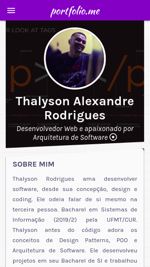

# portfolio.me

<h1 align="center">portfolio.me</h1>
<p align="center">Template responsivo para portfólio de desenvolvedor Web/Mobile desenvolvido com Vue.js, materialize e Github Pages.:heavy_check_mark:</p>

<div align="center">

[](https://github.com/thalysonalexr/portfolio/tags)
[](https://github.com/thalysonalexr)
[](https://github.com/thalysonalexr/portfolio/commits)
[](https://github.com/thalysonalexr/portfolio/blob/master/LICENSE)
</div>

## :information_source: Sobre o projeto

Neste ano percebi a necessidade de trabalhar mais no marketing pessoal, desta maneira nada melhor do que criar um portfolio para exibir meus projetos, habilidades e contato. Mas porque não utilizar **[Behance](https://www.behance.net/)** ou outro site de portfolio? O princípio DIY (*faça você mesmo*)! Neste template construído com Vue.js tracei os objetivos que eu gostaria de mostrar e principalmente algo feito totalmente por mim, mas nada impede de você aproveitar este conhecimento e adequar as suas necessidades!

### Acesse no mobile

<div align="center">

  

  

  

  

</div>

### Ou desktop

<div align="center">

  

  

  

</div>

## :rocket: Como instalar e executar?

Muito simples, vamos lá:

```bash
# clone o repo
$ git clone https://github.com/<seu-usuario>/portfolio.git

# vá até o diretório
$ cd portfolio

# instale as dependências
$ yarn install

# execute
$ yarn start

# realizar deploy para o github pages (irá criar a branch gh-pages)
$ yarn deploy

# caso precise forçar o deploy (não recomendado)
$ yarn deploy -f
```

> Nota: este portfolio atualmente consome os dados de arquivos hospedados em outro repo do github. Porém você pode e deve consumir de uma API para que este template seja mais manutenível.

## :thinking: Como contribuir?

- Faça um fork do projeto;
- Crie um branch com sua feature: `git checkout -b my-feature`;
- Faça commit das adições/alterações: `git commit -m 'feat: My new feature'`;
- Faça um push para seu branch: `git push -u origin my-feature`;
- Abra uma solicitação pull request para o repo original :heart:.

## :memo: Licença

Lançado em 2020. Este projeto está sob a [**licença MIT**](https://github.com/thalysonalexr/portfolio/blob/master/LICENSE)

Desenvolvido com :heartbeat: por [**Thalyson Rodrigues**](https://www.linkedin.com/in/thalysonrodrigues/)